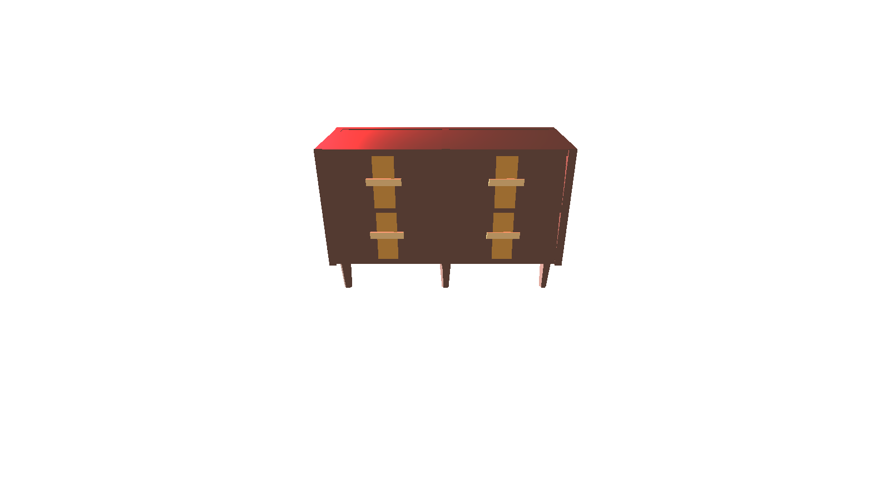
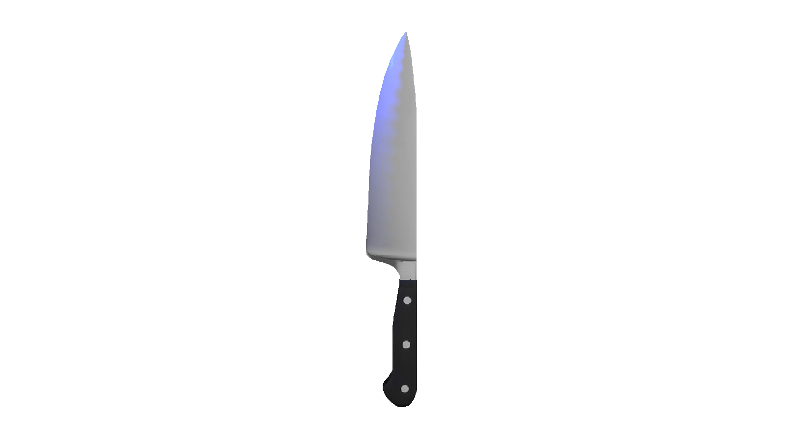
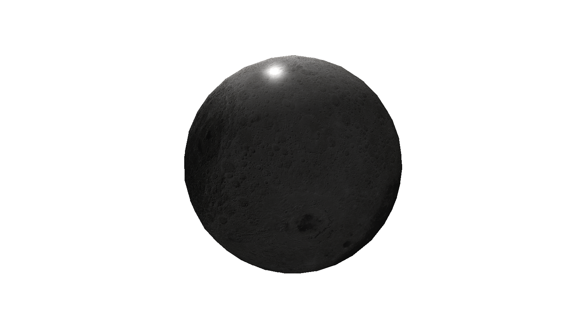

# 3DRenderer

Choose 1 of the tests in source/main.cpp to run it.  
To build a project run source/build.bat script.  
Then run bin/renderer.exe to run renderer.    

Camera movement:
  Up / Down arrows &mdash; move camera forward / backward  
  Left / Right arrows &mdash; move camera left / right  
  Space / Alt &mdash; move camera up / down  
  W / S &mdash; rotate camera up / down  
  A / D &mdash; rotate camera left / right  

Some examples:

